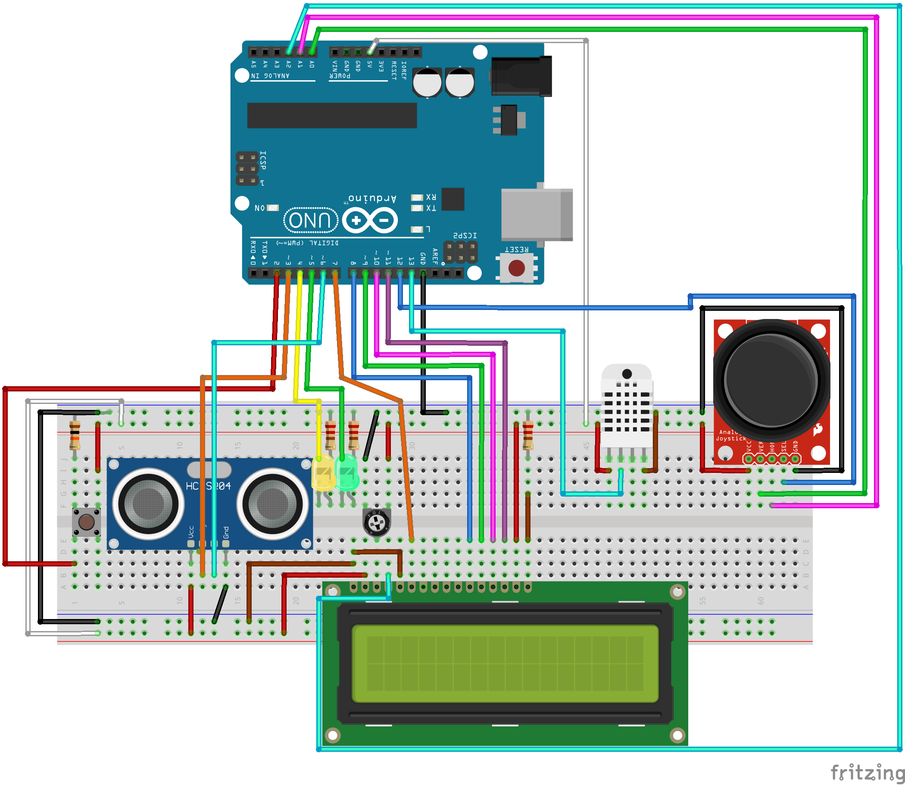

# Controlador de Máquina Expendedora

Esta práctica consiste en la creación de un controlador con Arduino capaz de actuar como una máquina expendedora y haciendo uso de diversos sensores.
La implementación constará de 3 apartados diferenciados:
- El arranque
- El servicio
- El modo administrador

Cada apartado tendrá una funcionalidad distinta y deberán funcionar en conjunto.

## Materiales

Los materiales usado son los siguientes:
- Una plcaca de Arduino UNO
- Un LCD 16x2
- Un Joystick
- Un Sensor de Temperatura y Humedad DHT11
- Un Sensor de Ultrasonido
- Un botón
- 2 LEDS

## Esquema de conexión

El esquema de conexión de todas las partes es la mostrada en la siguiente imagen. 
Se ha usando el programa Fritzing para realizarlo.

## Implementación del código

Para empezar, he dividido las tres etapas del programa, (Arranque, Servicio y Admin) en sub-estados y he usado interrupciones y threads para cambiar de un estado a otro, para evitar gastar mucho tiempo en ISR.

### Arranque

El arranque es sencillo, únicamente hay un thread que se encarga de encender y apagar el LED en intervalos de 1s y al activarse 6 veces, (se habría encendido 3), pasa al siguiente estado.

### Servicio

Para mayor simplicidad he dividido la etapa de servicio en 5 sub-estados:

- Waiting: Espera ha recibir una medida menor de 100 (1m) del láser.

- Showing DHT: Muestra la temperatura y humedad durante 5 segundos usando un timer (interrupción software).

- Menu: Muestra los productos y permite la navegación y la selección de los productos.
Para los productos, he creado una estructura que se compone del nombre y del precio de cada producto, para más tarde poder modificar el precio fácilmente.
Además todos los productos están guardados en un array para poder recorrerlos todos en el menú.

- Prepare: Pone un timer aleatorio entre 4 y 8 segundos, muestra el producto seleccionado en el LCD y enciende un LED de forma incremental.
La potencia enviada al LED consta de un factor que depende del tiempo de espera aleatorio y la va incrementando hasta llegar al 100% (255).

- Done: Imprime "Retire Bebida" durante 3 segundos, de nuevo, usando un timer que al cumplir el periodo cambia de estado a Waiting.

### Admin

Igual que con Servicio, he dividido la etapa de Admin en sub-estados para facilitar la implementación. Estos son los sub-estados:

- Admin Menu: Muestra el menú con las opciones de administrador. Estas opciones son estructuras compuestas por el nombre y un entero que define el estado al que pertenece esa opción.
Este sub-estado permite acceder a los demás estados seleccionando su opción con el Joystick.

- Temperatura: Muestra de forma interactiva la temperatura y la humedad actual hasta que se regrese al menú de admin o se salga de la etapa admin.

- Distancia: Muestra la medida de la distancia del sensor de ultrasonido.

- Contador: Muestra los segundos que han pasado desde que se encendió la placa. Los segundos son calculados usando un thread encargado de, cada segundo, añadir 1 a una variable.

- Precios: Muestra la lista de productos con sus precios actuales y permite seleccionarlos y cambiar al siguiente estado para cambiarles el precio.

- Mod precios: En este estado, es posible cambiar el precio del producto seleccionado en el estado "Precios", usando el Joystick, incrementas o disminuyes en 0.05 el valor que se le suma al precio original y lo muestra por pantalla. Al pulsar el Joystick se guarda el cambio y al mover el Joystick hacia la izquierda, se vuelve al menú anterior. 
Si no se ha guardado el cambio, este no se efectúa.

Además de comprobar el estado actual, la función loop(), comprueba el estado del botón y llama al thread que actualiza los segundos en cada iteración.

## Otras Implementaciones
Por falta de tiempo no he podido implementar un watchdog, sin embargo el programa no parece bloquearse.

La idea principal de la implementación del botón era a través de una interrupción hardware, sin embargo, para medir el tiempo pulsado y evitar el bouncing, solo se me ocurría usar millis(), y dado que en una ISR no se pueden usar, y el cómputo debe ser mínimo, opté por comprobar el estado en cada iteración de manera activa. Esto al final, no ha supuesto ningún problema y el comportamiento es el deseado en todas las situaciones que he probado.

El contador Timer1 a veces puede no corresponderse con el tiempo deseado debido a varios factores, sin embargo, haciendo dettachInterrupt(), start() y stop(), parece haberse mejorado mucho el comportamiento.

Para comunicar las variables entre las distintas funciones evitando el paso de argumentos, he declarado varias variables globales así como distintos threads para los distintos sensores.

En total he creado threads para hacer scroll del LCD cada 0.3s, para encender ambos LEDs, para mostrar la distancia en el modo admin cada 0.2s, para mostrar el sensor DHT cada 2s, para este último, 2 threads distintos para el modo normal y el modo admin, y otros dos para contar los segundos y para mostrarlos, así como un último para leer el Joystick, haciendo un total de 10 threads que trabajan conjuntamente.

## Video

Aquí un video del funcionamiento del controlador.

<iframe src="https://jumpshare.com/embed/48FxAYcAk2giIT5oXqwC" frameborder="0" webkitallowfullscreen mozallowfullscreen allowfullscreen style="position: absolute; top: 0; left: 0; width: 100%; height: 100%;"></iframe>

[Vuelve al blog](../)
